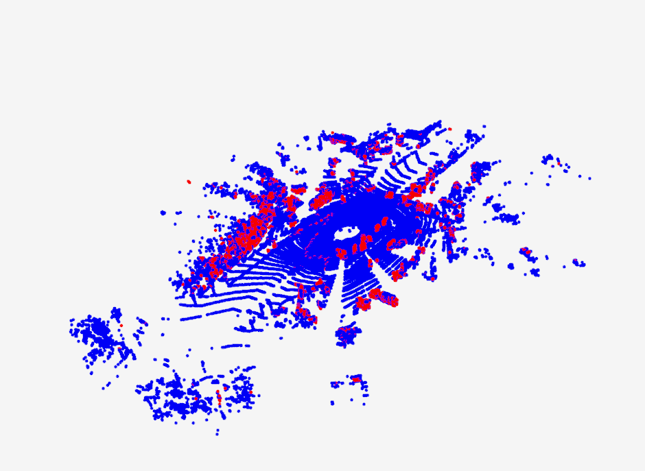
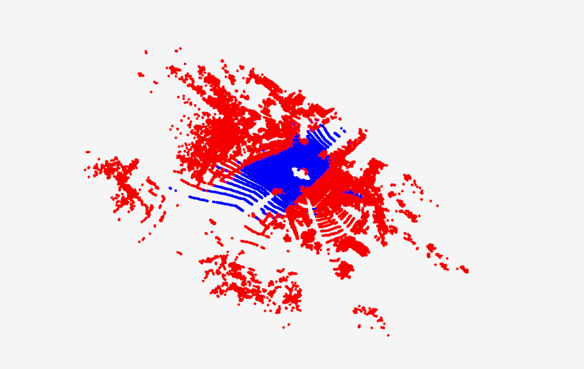
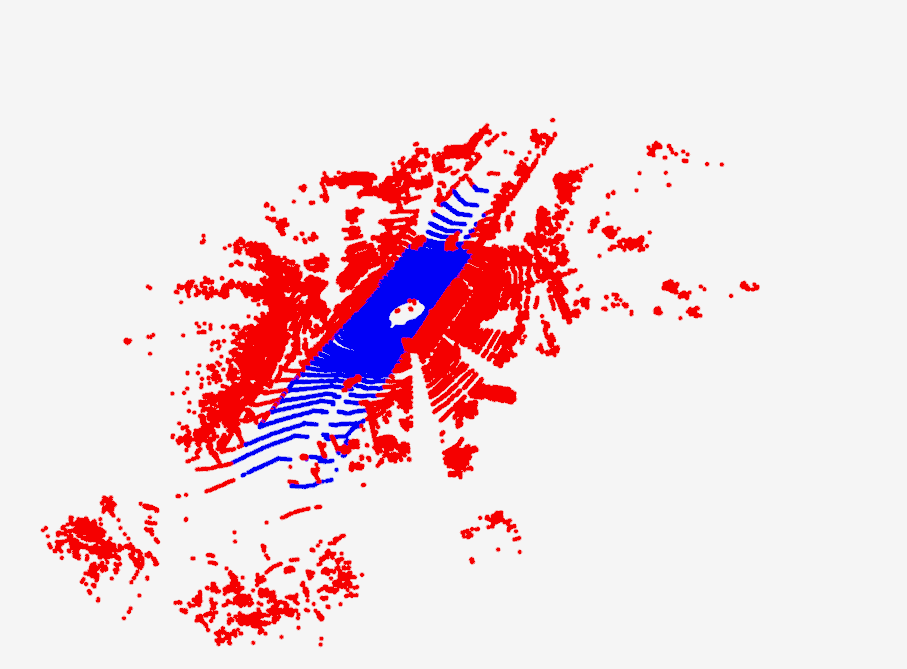

# pc_superposition

# 地面过滤
安装依赖：pip install open3d-python

点云个数：124230

图片中红的点为非地面点，蓝色的点为地面点
## 地面过滤算法
地面点个数：103483

运行时间：1.92s

## 点云分割算法
地面点个数：59575

运行时间：0.22s

## ground_truth
地面点个数:61529

两个算法对比：
    地面过滤算法过滤的地面点太多了，很多感觉是非地面点都被过滤了，地面分割算法过滤地面的准确率和标注的数据相近。运行时间，地面过滤算法明速度慢于点云分割算法。】

## 量化结果
在10个sequence上进行了iou计算，ground_truth为semantic提供的label。
### 地面过滤算法

序列  | 01 | 02 | 03 | 04 | 05  | 06 | 07  | 08 | 09  | 10
 ----- | ----- | -----  | ----- | -----  | ----- | -----  | ----- | -----  | ----- | -----  
 min  |0.244|0.180|0.181|0.393|0.146|0.125|0.157|0.118|0.172|0.119
 max  |0.728|0.673|0.599|0.612|0.588|0.664|0.531|0.550|0.505|0.491 
 avr |0.517|0.304|0.299|0.529|0.276|0.272|0.297|0.267|0.303|0.255 

